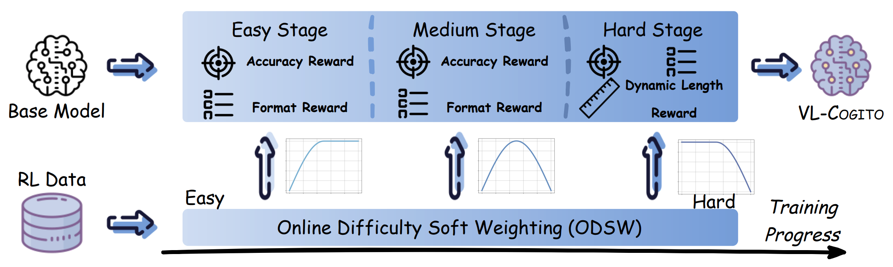

<h1 align="center">VL-Cogito</h1>
<p align="center">
<a href="https://github.com/alibaba-damo-academy/VL-Cogito" target="_blank" rel="noopener">Website</a>
&nbsp;&nbsp;
<a href="https://huggingface.co/csyrf/VL-Cogito" target="_blank" rel="noopener"> Model </a>
&nbsp;&nbsp;
<a href="https://huggingface.co/datasets/csyrf/VL-Cogito" target="_blank" rel="noopener"> Dataset </a>
&nbsp;&nbsp;
<a href="https://arxiv.org/abs/2507.22607" target="_blank" rel="noopener">Paper</a>
</p>



The homepage of our multimodal reasoning model—VL-Cogito! 
Inspired by the Latin word “Cogito” (“I think”), VL-Cogito is built for complex and diverse multimodal reasoning tasks, with a strong focus on autonomous thinking and adaptability.

**What makes VL-Cogito stand out?**

Progressive Curriculum Reinforcement Learning (PCuRL):Through a multi-stage, “from easy to hard” reinforcement learning approach, VL-Cogito’s reasoning abilities are significantly enhanced across a wide range of multimodal scenarios!

**Two key innovations:**
+ Online difficulty weighting: Dynamically adjusts training difficulty, allowing the model to progress step by step from easier to more challenging examples.
+ Dynamic length reward: Encourages the model to adapt the length of its reasoning process based on the complexity of each individual problem, balancing both accuracy and efficiency.

**Outstanding Performance:**

VL-Cogito demonstrates stable, state-of-the-art or superior results on mainstream multimodal reasoning benchmarks, covering mathematics, science, logic, and commonsense understanding!

**Training:**

The code is a fork of the original EasyR1.

The training scripts can be found in examples folder, which include four scripts: basic grpo for MLLM Reasoning, stage1 for VL-Cogito, stage2 for VL-Cogito, and stage3 for VL-Cogito. The training script is designed for single node by default, but can be used with multiple GPUs. Some necessary file pathes and environment variables need to be added in the the script before the training.

Explaination of some important hyperparameters:
+ **worker.reward.compute_score**: The reward used in the training. Options: r1v(basic grpo), r1v+cir(grpo + online difficulty weighting), r1v+length+cir(grpo + online difficulty weighting + dynamic length reward).
+ **worker.reward.cur_type**: The type of online difficulty weighting curve used in the training. Options: h_1(Binary [0.00, 0.50]), h_2(Binary [0.25, 0.75]), h_3(Binary [0.50, 1.00]), s_1(hard stage), s_2(medium stage), s_3(easy stage).
+ **worker.reward.tar_len**: The target reasoning length of dynamic length reward. 

Train the model.
```
bash examples/stage1.sh
```
After the training, use scripts/model_merger.py to convert the ckpt to hf model.
```
python scripts/model_merger.py --local_dir your_ckpt_path --hf_upload_path path_for_hf_model
```
